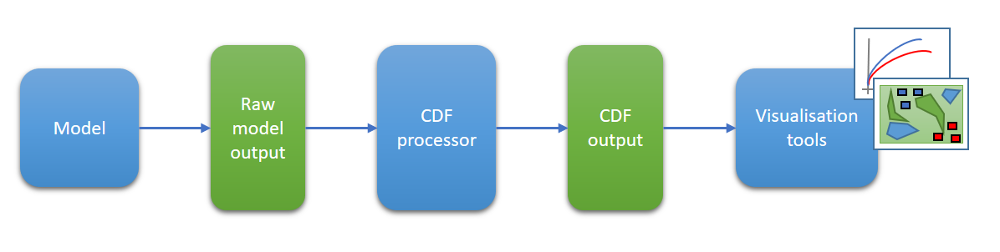

# SWAP - Common Data Format Processor

**The Common Data Format processor software is licensed under the Apache License, Version 2.0 (the "License") you may not use the software except in compliance with the License. A copy of the license is incldued within this repository: [LICENSE.txt](LICENSE.txt)**

**Unless required by applicable law or agreed to in writing, software distributed under the License is distributed on an "AS IS" BASIS, WITHOUT WARRANTIES OR CONDITIONS OF ANY KIND, either express or implied. See [LICENSE.txt](LICENSE.txt) for the specific language governing permissions and limitations under the License.**

## Simulation & Wargaming Analytical Pipeline

The Simulation & Wargaming Analytical Pipeline (SWAP) is a collection of Dstl developed tools and visualisations that aims to standardise and improve quantitative analysis of combat models. 
A critical component of the SWAP is the Common Data Format (CDF) which standardises the way model output is stored. 
This repo is the first part of the SWAP tool set to be open sourced and contains the software components that are common across all model processors, as well as a demo processor and a test suite. 
This repo does not contain any of the SWAP visualisation or analysis tools which may be released at a later date.

## What is the idea of the Common Data Format?

The core concept underpinning the Common Data Format (CDF) is that combat models, simulations and wargames consist of 
interacting entities and that these interactions can be expressed in a way that is agnostic of their source.

In practical terms the CDF enables outputs from different sources to be captured in a consistent, machine and 
human-readable format that can be easily visualised.

## What does the Common Data Format Processor do? 

The CDF processor converts raw output from supported models into CDF Outputs ([CDFOutputs.md](processor_core/Vignettes/CDFOutputs.md)).

**It is entirely the responsibilty of the user to carry out sufficient manual checks to assure themselves that any Common Data Format outputs generated are an accurate representation of the raw outputs.**

This repository conatins the core elements of the CDF processor and some demo materials. It also includes a full pytest test suite
for the core elements within the 'test' folder. These tests can be run by cd'ing into the test folder in a terminal and 
calling pytest. The test results will print to the terminal and some test outputs will be generated in subfolders within the 
test/Output folder.

## Sounds great! What do I need to get started using the Common Data Format?

First of all you will need a Python set up as described in the next section (*note that no Python coding knowledge is
required as there is no need to interact with any of the CDF processor Python code directly*).

You will also need to either download or clone this repository. 

This repository contains some demo inputs in the 'Demo_Input' folder, a demo configuration file and a demo model processor 
script. These can be used to practice working with the CDF processor, confirm that your python set-up is working correctly, 
explore the various processor options available and produce some demo outputs. In addition the demo model processor script (Demo_Processor.py) included in this repository is fully commented and follows the structure described in [ProcessorDesc.md](processor_core/Vignettes/ProcessorDesc.md) which is common across all model processor scripts.

## What Python set up do I need?

Dependencies have deliberately been kept to a minimum to make set up as simple as possible. You will need Python 3.9 or later installed along with the packages and modules listed in [CoreRequirments.md](processor_core/Vignettes/CoreRequirements.md) (or the ability to install them). 

Any additional packages and modules required for specific model processors will be listed in that repository's readme file.

## OK, I've got all that ready to go, what next?

Next the configuration file needs to be set up. This file tells the model processor where the input files to process are located, where the CDF outputs ([CDFOutputs.md](processor_core/Vignettes/CDFOutputs.md)) should be generated and configures various processing options.

Open the configuration file (demo_config.csv) found in this repository. Since this is a demo file it includes an example configuration line so there is no need to make to make any changes before proceeding to the next step if you just want to test your Python set up or generate some demo CDF outputs. However, if you wish to explore the processor configuration options available, use the guide in [ConfigFields.md](processor_core/Vignettes/ConfigFields.md) to make changes to the example configuration line and / or add additional configuration lines and then proceed to the next step. 

A more detailed version of the workflow described across this and the following section can be found in [DetailedWorkflow.md](processor_core/Vignettes/DetailedWorkflow.md). *Note that individual models will have different input file parameters as well as additional, model specific, options. These are always described in the readme of the repository for the model processor*. 

## I have populated the configuration file, what do I do now?

Save the configuration file, close it and run the Demo_Processor.py file in Python. If your Python set up is working correctly then this will produce some output in the terminal, generate a batch log file and create an 'Output' folder in the working directory. This folder will contain a set of CDF output and log files as described in [CDFOutputs.md](processor_core/Vignettes/CDFOutputs.md).

These outputs are produced from the set of input files in the 'Demo_Input' folder. These can be examined to trace the raw outputs through to their CDF equivilents. The demo inputs have a very simple structure and are intended to illustrate how the processor works rather than being representative of the outputs from any particular model. 

## I want to know more about the Common Data Format!

This readme is intended as a very high level guide to the Common Data Format (CDF) and working with the CDF Processor.

Detail of how the CDF code and repository are structured can be found in [CDFStructure.md](processor_core/Vignettes/CDFStructure.md) 
and an explanation of how the model processor scripts work can be found in [ProcessorDesc.md](processor_core/Vignettes/ProcessorDesc.md).

Additional information is available in the various supporting files within the Vignettes folder. These are linked from the various sections above and the links are also gathered together below for convenience:
- detailed workflow description - [DetailedWorkflow.md](processor_core/Vignettes/DetailedWorkflow.md)
- guide to configuration set up and options - [ConfigFields.md](processor_core/Vignettes/ConfigFields.md)
- requriements for the core processor elements - [CoreRequirements.md](processor_core/Vignettes/CoreRequirements.md)
- description of CDF outputs - [CDFOutputs.md](processor_core/Vignettes/CDFOutputs.md)
- dataset class version log - [Dataset_version_log.md](processor_core/Vignettes/Dataset_version_log.md)
- guide to CDF helper functions [CDF_Functions.md](processor_core/Vignettes/CDF_Functions.md)
- version log for CDF helper functions [CDF_Func_version_log.md](processor_core/Vignettes/CDF_Func_version_log.md)

If you have further questions please get in touch with the CDF processor team as listed in [Contact.md](processor_core/Vignettes/Contact.md)
