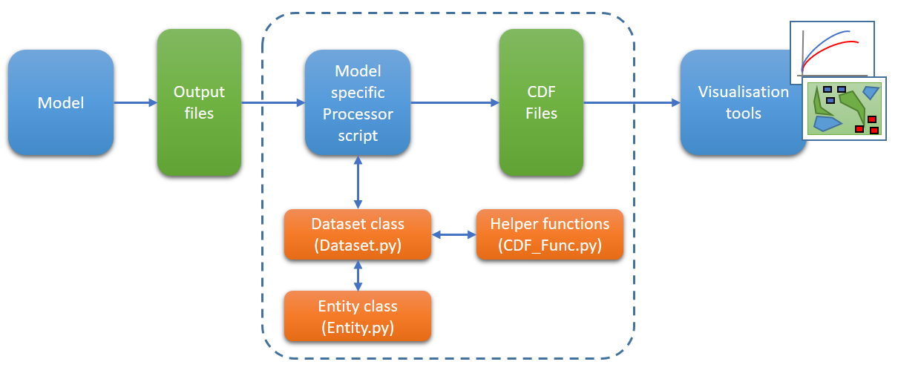

# Common Data Format Processor codebase structure

The structure of the Common Data Format (CDF) codebase deliberately separates common and processor specific elements. 
This enables efficient re-use of common code elements whilst still allowing processors to be tailored to individual 
models. This also means that common elements as well as output formats and structures can be updated without having to 
repeat changes across all processors.

The diagram below illustrates this structure, as well as the overall concept of the CDF, with the scope of the CDF 
processor capability indicated by the dashed blue line. Common CDF processor elements are shown in orange. These are 
utilised by the model specific processor scripts which process raw model output files to produce the CDF output files. 

# Versioning

All elements are Versioned using a semantic versioning convention of 0.0.0 where the first digit represents a major 
release, the second digit a minor release and the third digit a patch or bug fix. The differentiation between a major 
and minor release is if the [workflow](DetailedWorkflow.md) changes as a result. 
The version log for the Dataset class can be found [here](Dataset_version_log.md) and the version log for the CDF 
helper functions can be found [here](CDF_Func_version_log.md).

# Common Data Format Processor repository structure

Each supported model has its own Common Data Format processor repository (processor_modelname) within the COTS 
Common Data Format project. These repositories include everything required to process outputs from the model into 
[Common Data format Outputs](CDFOutputs.md). 

An additional repository (processor_core) contains the master version of the common CDF processor elements:
- Dataset.py ([Version log](Dataset_version_log.md))
- Entity.py
- CDF_Func.py ([Version log](CDF_Func_version_log.md))
- test folder containing the pytest test suite
- A readme file along with additional supporting material in the 'Vignettes' folder
- .gitignore file

In addition to the common elements required for processing each model processor repository contains:
- The processor script for the model (ModelName_Processor.py)
- The configuration file template for the processor script (ModelName_config.csv)
- The version log for the model processor (ModelName_version_log.md)
- Any other model specific assets required

# Development and repository branches

Development of model processor specific elements is carried out within their respective repositories by creating
a suitable branch, implementing and testing the development and then merging that branch into the master branch of 
the repository.

Development of common elements is carried out in a similar way within the processor_core repository. Updated common
elements are promulgated to model processor repositories by creating a test branch within the model processor 
repository and replacing the common elements within that branch with the relevant source files from processor_core 
repository. This branch is then tested, model specific elements are updated as needed and once, working satisfactorily, 
merged into the master branch of the model processor repository.
